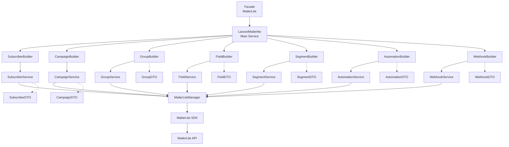
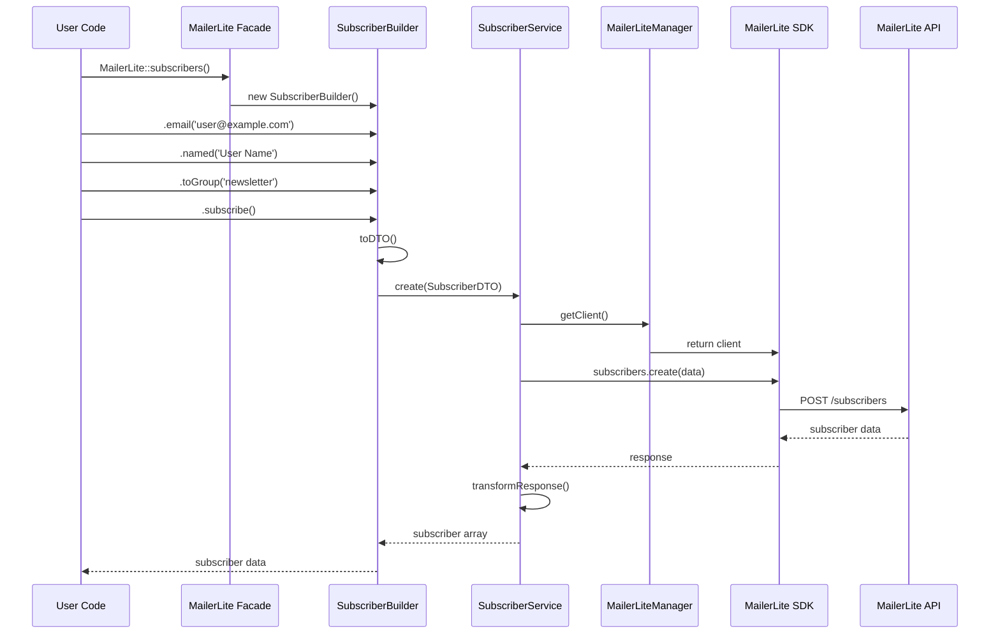
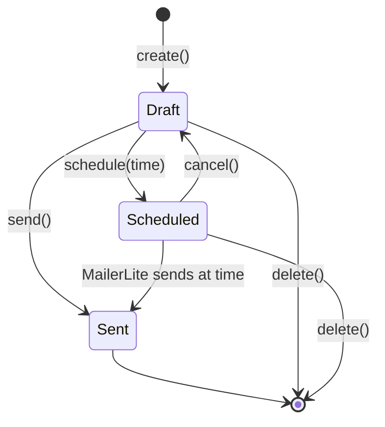
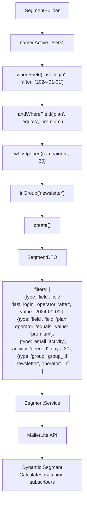
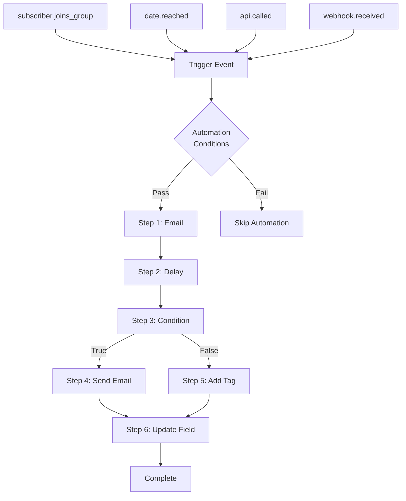
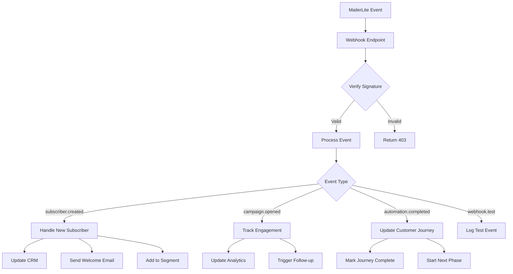

# Laravel MailerLite

[](https://packagist.org/packages/theihasan/laravel-mailerlite)
[](https://github.com/theihasan/laravel-mailerlite/actions?query=workflow%3Arun-tests+branch%3Amain)
[](https://github.com/theihasan/laravel-mailerlite/actions?query=workflow%3A"Fix+PHP+code+style+issues"+branch%3Amain)
[](https://packagist.org/packages/theihasan/laravel-mailerlite)

A comprehensive, fluent Laravel wrapper for the official MailerLite PHP SDK. Provides strongly-typed DTOs, expressive builders that read like English, robust services with granular exception handling, contracts for testability, and comprehensive test coverage.

**Key Features:**
- 🚀 Fluent API that reads like plain English
- 📝 Strongly-typed DTOs with validation
- 🔧 Comprehensive builder pattern for all resources
- 🎯 Granular exception handling with context
- 🧪 Full test coverage with mocking support
- 📦 Laravel service container integration
- 🔌 Clean contracts for dependency injection

## Table of Contents

- [Package Overview](#package-overview)
  - [Purpose and High-Level Architecture](#purpose-and-high-level-architecture)
  - [Supported MailerLite Resources](#supported-mailerlite-resources)
- [Installation](#installation)
  - [Composer Install](#composer-install)
  - [Publish Config](#publish-config)
- [Configuration](#configuration)
  - [API Key Setup](#api-key-setup)
  - [Runtime API Key Override](#runtime-api-key-override)
- [Quick Start / Fluent API](#quick-start--fluent-api)
  - [Subscribers](#subscribers)
  - [Campaigns](#campaigns)
  - [Groups](#groups)
  - [Fields](#fields)
  - [Segments](#segments)
  - [Automations](#automations)
  - [Webhooks](#webhooks)
- [Resources Reference](#resources-reference)
  - [Subscribers Reference](#subscribers-reference)
  - [Campaigns Reference](#campaigns-reference)
  - [Groups Reference](#groups-reference)
  - [Fields Reference](#fields-reference)
  - [Segments Reference](#segments-reference)
  - [Automations Reference](#automations-reference)
  - [Webhooks Reference](#webhooks-reference)
- [Exception Reference](#exception-reference)
- [Testing](#testing)
- [Versioning & Changelog](#versioning--changelog)

---

## Package Overview

### Purpose and High-Level Architecture

This package provides a Laravel-native interface to MailerLite's API with the following architectural components:

- **DTOs (Data Transfer Objects)**: Strongly-typed, validated data containers
- **Builders**: Fluent, chainable APIs that read like natural language
- **Services**: Resource-specific API orchestration with comprehensive error handling
- **Manager**: Centralized SDK client management with authentication
- **Contracts**: Interfaces for clean dependency injection and testing
- **Facade**: Convenient static access for quick operations
- **Exceptions**: Granular, contextual exceptions for precise error handling

**Architecture Flow:**



### Supported MailerLite Resources

- **Subscribers**: Create, update, delete, subscribe/unsubscribe, group management
- **Campaigns**: Draft, schedule, send, A/B testing, analytics
- **Groups**: Create, manage, subscriber assignment
- **Fields**: Custom field creation and management
- **Segments**: Dynamic subscriber segmentation with complex filters
- **Automations**: Email sequences, triggers, conditions, actions
- **Webhooks**: Real-time event notifications with security

---

## Installation

### Composer Install

```bash
composer require theihasan/laravel-mailerlite
```

The package will auto-register via Laravel's package discovery.

### Publish Config

```bash
php artisan vendor:publish --provider="Ihasan\\LaravelMailerlite\\LaravelMailerliteServiceProvider" --tag=config
```

This publishes `config/mailerlite.php`.


**Development workflow:**
```bash
# Pull latest changes
git mailerlite-pull

# Push your changes
git mailerlite-push
```

---

## Configuration

### API Key Setup

Add your MailerLite API key to `.env`:

```bash
MAILERLITE_API_KEY=your_api_key_here
MAILERLITE_API_URL=https://connect.mailerlite.com/api/
MAILERLITE_TIMEOUT=30
```

**Configuration file** (`config/mailerlite.php`):
```php
return [
    'key' => env('MAILERLITE_API_KEY'),
    'url' => env('MAILERLITE_API_URL', 'https://connect.mailerlite.com/api/'),
    'timeout' => env('MAILERLITE_TIMEOUT', 30),
];
```

### Runtime API Key Override

For multi-tenant applications or dynamic API keys:

```php
use Ihasan\LaravelMailerlite\Manager\MailerLiteManager;

// Create manager with custom API key
$manager = new MailerLiteManager('custom-api-key');
$this->app->instance(MailerLiteManager::class, $manager);

// Or with options
$manager = new MailerLiteManager('custom-api-key', [
    'timeout' => 60,
    'base_url' => 'https://custom.api.url'
]);
```

---

## Quick Start / Fluent API

All operations use the `MailerLite` facade with fluent method chaining that reads like English.

### Subscribers

#### Create Subscriber
```php
use Ihasan\LaravelMailerlite\Facades\MailerLite;

$subscriber = MailerLite::subscribers()
    ->email('jane@example.com')
    ->named('Jane Doe')
    ->withField('company', 'Acme Inc')
    ->toGroup('Early Adopters')
    ->subscribe();
```

**Step-by-step:**
1. Start with `MailerLite::subscribers()` to get a `SubscriberBuilder`
2. Chain fluent setters: `email()`, `named()`, `withField()`, `toGroup()`
3. Call `subscribe()` to create the `SubscriberDTO` and send to API
4. Returns subscriber data with ID

**Fluent API Flow:**



**Expected Result:**
```php
[
    'id' => '12345',
    'email' => 'jane@example.com',
    'name' => 'Jane Doe',
    'status' => 'active',
    'fields' => ['company' => 'Acme Inc'],
    'groups' => [['id' => 'group-id', 'name' => 'Early Adopters']],
    'created_at' => '2024-01-15T10:30:00Z'
]
```

**Exception Handling:**
```php
try {
    $subscriber = MailerLite::subscribers()
        ->email('invalid-email')
        ->subscribe();
} catch (InvalidArgumentException $e) {
    // DTO validation failed (invalid email, missing required fields)
    logger()->warning('Invalid subscriber data', ['error' => $e->getMessage()]);
} catch (Ihasan\LaravelMailerlite\Exceptions\MailerLiteAuthenticationException $e) {
    // Invalid or missing API key
    logger()->error('MailerLite authentication failed', ['error' => $e->getMessage()]);
} catch (Ihasan\LaravelMailerlite\Exceptions\SubscriberCreateException $e) {
    // Subscriber already exists, validation failed, etc.
    logger()->error('Failed to create subscriber', [
        'error' => $e->getMessage(),
        'context' => $e->getContext()
    ]);
}
```

#### Find and Update Subscriber
```php
// Find by email
$found = MailerLite::subscribers()
    ->email('jane@example.com')
    ->find();

if ($found) {
    // Update existing subscriber
    $updated = MailerLite::subscribers()
        ->email('jane@example.com')
        ->named('Jane Z. Doe')
        ->withField('plan', 'premium')
        ->update();
}
```

#### Subscribe/Unsubscribe Operations
```php
// Unsubscribe
$result = MailerLite::subscribers()
    ->email('jane@example.com')
    ->unsubscribe();

// Resubscribe
$result = MailerLite::subscribers()
    ->email('jane@example.com')
    ->resubscribe();
```

#### Group Management
```php
// Add to group
MailerLite::subscribers()
    ->email('jane@example.com')
    ->addToGroup('premium-users');

// Remove from group
MailerLite::subscribers()
    ->email('jane@example.com')
    ->removeFromGroup('trial-users');
```

#### Alternative DTO Approach
```php
use Ihasan\LaravelMailerlite\DTOs\SubscriberDTO;

$dto = new SubscriberDTO(
    email: 'jane@example.com',
    name: 'Jane Doe',
    fields: ['company' => 'Acme Inc'],
    groups: ['early-adopters']
);

$subscriber = app(Ihasan\LaravelMailerlite\Resources\Subscribers\SubscriberService::class)
    ->create($dto);
```

---

### Campaigns

#### Draft and Create Campaign
```php
$campaign = MailerLite::campaigns()
    ->subject('Spring Newsletter')
    ->from('Newsletter Team', 'news@acme.com')
    ->html('<h1>Spring Updates</h1><p>What\'s new this season...</p>')
    ->plain('Spring Updates - What\'s new this season...')
    ->toGroups(['newsletter', 'customers'])
    ->create();
```

**Step-by-step:**
1. `MailerLite::campaigns()` returns a `CampaignBuilder`
2. Set required fields: `subject()`, `from()`, content (`html()` or `plain()`)
3. Add targeting with `toGroups()` or `toSegments()`
4. `create()` builds `CampaignDTO` and creates draft campaign
5. Returns campaign data with ID and status

**Campaign Builder Flow:**

```mermaid
graph LR
    A["User Code"] --> B["MailerLite::campaigns()"]
    B --> C["CampaignBuilder"]
    C --> D[".subject('Newsletter')"]
    D --> E[".from('Team', 'email')"]
    E --> F[".html('&lt;h1&gt;Content&lt;/h1&gt;')"]
    F --> G[".toGroup('subscribers')"]
    G --> H[".scheduleAt(tomorrow)"]
    H --> I[".schedule()"]
    I --> J["CampaignService"]
    J --> K["MailerLite SDK"]
    K --> L["API: Create Draft"]
    L --> M["API: Schedule Campaign"]
    M --> N["Scheduled Campaign"]
```



#### Schedule Campaign
```php
$scheduled = MailerLite::campaigns()
    ->subject('Weekend Sale')
    ->from('Sales Team', 'sales@acme.com')
    ->html('<h1>50% Off Everything!</h1>')
    ->toSegment('active-customers')
    ->scheduleAt(now()->addDays(2))
    ->schedule();
```

**Campaign Flow Diagram:**



#### Send Immediately
```php
$sent = MailerLite::campaigns()
    ->subject('Breaking News')
    ->from('News Team', 'news@acme.com')
    ->html('<h1>Important Update</h1>')
    ->toGroup('subscribers')
    ->send(); // Creates and sends immediately
```

#### A/B Test Campaign
```php
$abTest = MailerLite::campaigns()
    ->subject('A/B Test Subject')
    ->from('Marketing', 'marketing@acme.com')
    ->html('<h1>Version A Content</h1>')
    ->toGroup('test-group')
    ->abTest([
        'test_type' => 'subject',
        'send_size' => 25  // Test with 25% of recipients
    ])
    ->create();
```

#### Manage Existing Campaigns
```php
// Find campaign
$campaign = MailerLite::campaigns()->find('campaign-id');

// Update campaign
MailerLite::campaigns()
    ->subject('Updated Subject')
    ->update('campaign-id');

// Send existing campaign
MailerLite::campaigns()->sendById('campaign-id');

// Schedule existing campaign
MailerLite::campaigns()->scheduleById('campaign-id', now()->addHour());

// Cancel scheduled campaign
MailerLite::campaigns()->cancel('campaign-id');

// Get campaign stats
$stats = MailerLite::campaigns()->stats('campaign-id');

// Get campaign subscribers
$subscribers = MailerLite::campaigns()->subscribers('campaign-id');

// Delete campaign
MailerLite::campaigns()->delete('campaign-id');
```

---

### Groups

#### Create and Manage Groups
```php
// Create group
$group = MailerLite::groups()
    ->name('VIP Customers')
    ->withDescription('High-value customers with premium access')
    ->withTags(['premium', 'vip'])
    ->create();

// Find group
$found = MailerLite::groups()->find('group-id');

// Update group
$updated = MailerLite::groups()
    ->name('Premium VIP Customers')
    ->withDescription('Updated description')
    ->update('group-id');

// Delete group
MailerLite::groups()->delete('group-id');
```

#### Group Subscriber Management
```php
// Get subscribers in group
$subscribers = MailerLite::groups()->getSubscribers('group-id', ['limit' => 50]);

// Add subscribers to group
MailerLite::groups()->addSubscribers('group-id', ['subscriber-1', 'subscriber-2']);

// Remove subscribers from group
MailerLite::groups()->removeSubscribers('group-id', ['subscriber-1']);
```

---

### Fields

#### Create Custom Fields
```php
// Text field
$textField = MailerLite::fields()
    ->name('company')
    ->asText()
    ->withTitle('Company Name')
    ->create();

// Number field
$numberField = MailerLite::fields()
    ->name('age')
    ->asNumber()
    ->withTitle('Age')
    ->required()
    ->create();

// Date field
$dateField = MailerLite::fields()
    ->name('birthday')
    ->asDate()
    ->withTitle('Date of Birth')
    ->create();

// Boolean field
$boolField = MailerLite::fields()
    ->name('newsletter_opt_in')
    ->asBoolean()
    ->withTitle('Newsletter Subscription')
    ->withDefault(true)
    ->create();

// Select field
$selectField = MailerLite::fields()
    ->name('plan')
    ->asSelect(['basic', 'pro', 'enterprise'])
    ->withTitle('Subscription Plan')
    ->create();
```

#### Field Management
```php
// Find field by ID
$field = MailerLite::fields()->find('field-id');

// Find field by name
$field = MailerLite::fields()->findByName('company');

// Update field
MailerLite::fields()
    ->withTitle('Updated Title')
    ->update('field-id');

// Get field usage stats
$usage = MailerLite::fields()->getUsage('field-id');

// Delete field
MailerLite::fields()->delete('field-id');
```

---

### Segments

#### Create Dynamic Segments
```php
// Field-based segment
$segment = MailerLite::segments()
    ->name('Active Premium Users')
    ->whereField('plan', 'equals', 'premium')
    ->andWhereField('last_login', 'after', '2024-01-01')
    ->create();

// Email activity segment
$engagedSegment = MailerLite::segments()
    ->name('Highly Engaged')
    ->whoOpened(null, 30) // Opened any email in last 30 days
    ->andWhoClicked(null, 30) // And clicked in last 30 days
    ->create();

// Group-based segment
$groupSegment = MailerLite::segments()
    ->name('Newsletter VIPs')
    ->inGroup('newsletter-subscribers')
    ->andWhereField('engagement_score', 'greater_than', 80)
    ->create();

// Date-based segment
$recentSegment = MailerLite::segments()
    ->name('Recent Subscribers')
    ->createdAfter('2024-01-01')
    ->subscribedAfter('2024-01-01')
    ->create();
```

**Segment Filter Types:**
- **Field filters**: `whereField(field, operator, value)`
- **Group filters**: `inGroup(groupId)`, `notInGroup(groupId)`
- **Date filters**: `createdAfter(date)`, `subscribedBefore(date)`
- **Activity filters**: `whoOpened()`, `whoClicked()`, `whoDidntOpen()`

**Segment Building Process:**



#### Segment Management
```php
// Get segment subscribers
$subscribers = MailerLite::segments()->getSubscribers('segment-id');

// Refresh segment (recalculate)
MailerLite::segments()->refresh('segment-id');

// Get segment statistics
$stats = MailerLite::segments()->getStats('segment-id');

// Activate/deactivate
MailerLite::segments()->activate('segment-id');
MailerLite::segments()->deactivate('segment-id');
```

---

### Automations

#### Create Welcome Automation
```php
$automation = MailerLite::automations()
    ->create('Welcome Series')
    ->description('Welcome new subscribers with helpful content')
    ->whenSubscriberJoinsGroup('newsletter')
    ->sendEmail('welcome-template')
    ->delayDays(3)
    ->sendEmail('getting-started-template')
    ->delayWeeks(1)
    ->sendEmail('tips-template')
    ->start();
```

#### Advanced Automation with Conditions
```php
$conditional = MailerLite::automations()
    ->create('Smart Follow-up')
    ->whenSubscriberUpdatesField('purchase_status')
    ->delayHours(2)
    ->ifField('country', 'equals', 'US')
    ->sendEmail('us-specific-template')
    ->addTag('us-customer')
    ->delayDays(7)
    ->condition([
        ['field' => 'engagement_score', 'operator' => 'greater_than', 'value' => 50]
    ])
    ->sendEmail('high-engagement-template')
    ->start();
```

#### Date-Based Automation
```php
$birthday = MailerLite::automations()
    ->create('Birthday Campaign')
    ->whenDateReached('birthday', 0) // Trigger on birthday
    ->sendEmail('birthday-template')
    ->addTag('birthday-sent')
    ->updateField('last_birthday_email', now()->toDateString())
    ->start();
```

**Automation Trigger Flow:**



#### Automation Management
```php
// Find automation
$automation = MailerLite::automations()->find('automation-id');

// Control automation state
MailerLite::automations()->startById('automation-id');
MailerLite::automations()->stopById('automation-id');
MailerLite::automations()->pauseById('automation-id');
MailerLite::automations()->resumeById('automation-id');

// Get automation analytics
$stats = MailerLite::automations()->stats('automation-id');
$activity = MailerLite::automations()->activity('automation-id');
$subscribers = MailerLite::automations()->subscribers('automation-id');
```

---

### Webhooks

#### Create Event Webhooks
```php
// Subscriber events
$webhook = MailerLite::webhooks()
    ->onSubscriberCreated('https://app.example.com/webhooks/new-subscriber')
    ->withSecret('webhook-secret-key')
    ->create();

// Campaign events
MailerLite::webhooks()
    ->onCampaignOpened('https://app.example.com/webhooks/campaign-opened')
    ->asJson()
    ->timeout(60)
    ->create();

// Custom event with headers
MailerLite::webhooks()
    ->on('automation.subscriber_completed')
    ->url('https://app.example.com/webhooks/automation')
    ->withHeaders([
        'Authorization' => 'Bearer your-token',
        'X-App-ID' => 'your-app-id'
    ])
    ->verifySSL(true)
    ->create();
```

#### Webhook Security and Configuration
```php
$secureWebhook = MailerLite::webhooks()
    ->on('subscriber.created')
    ->url('https://app.example.com/webhooks/secure')
    ->named('Secure Subscriber Webhook')
    ->withSecret('your-webhook-secret')
    ->timeout(120)
    ->retries(5)
    ->asJson()
    ->verifySSL(true)
    ->create();
```

#### Handle Webhook Payload

**Webhook Processing Flow:**



```php
// Laravel route example
Route::post('/webhooks/mailerlite', function (Illuminate\Http\Request $request) {
    // Verify signature if using secrets
    $signature = $request->header('X-MailerLite-Signature');
    $payload = $request->getContent();
    $secret = config('app.mailerlite_webhook_secret');
    
    if ($secret && $signature) {
        $expectedSignature = hash_hmac('sha256', $payload, $secret);
        if (!hash_equals($expectedSignature, $signature)) {
            abort(403, 'Invalid webhook signature');
        }
    }
    
    // Process webhook data
    $data = $request->json()->all();
    
    match($data['event']) {
        'subscriber.created' => handleNewSubscriber($data['data']),
        'campaign.opened' => handleCampaignOpen($data['data']),
        'automation.completed' => handleAutomationComplete($data['data']),
        default => logger()->info('Unhandled webhook event', $data)
    };
    
    return response()->json(['status' => 'success']);
});
```

#### Webhook Management
```php
// Test webhook
$testResult = MailerLite::webhooks()->test('webhook-id');

// Get delivery logs
$logs = MailerLite::webhooks()->logs('webhook-id');

// Get webhook stats
$stats = MailerLite::webhooks()->stats('webhook-id');

// Enable/disable
MailerLite::webhooks()->enable('webhook-id');
MailerLite::webhooks()->disable('webhook-id');

// Find by URL
$webhook = MailerLite::webhooks()->findByUrl('https://app.example.com/webhook');
```

---

## Resources Reference

### Subscribers Reference

#### DTO Properties
| Property | Type | Required | Validation | Description |
|----------|------|----------|------------|-------------|
| email | string | ✅ | Valid email, not disposable | Subscriber email address |
| name | string\|null | ❌ | Max 255 chars | Full name |
| fields | array | ❌ | Scalar/null values only | Custom field key-value pairs |
| groups | array<string\|int> | ❌ | Non-empty IDs | Group IDs to assign |
| status | string | ❌ | active, unsubscribed, unconfirmed, bounced, junk | Subscription status |
| resubscribe | bool | ❌ | - | Resubscribe if already exists |
| type | string\|null | ❌ | regular, unsubscribed, imported | Subscriber type |
| segments | array<string\|int> | ❌ | Non-empty IDs | Segment IDs to assign |
| autoresponders | bool | ❌ | - | Send autoresponders |

#### Service Methods
| Method | Returns | Throws |
|--------|---------|--------|
| `create(SubscriberDTO $dto)` | array | SubscriberCreateException |
| `getByEmail(string $email)` | array\|null | MailerLiteAuthenticationException |
| `getById(string $id)` | array\|null | MailerLiteAuthenticationException |
| `update(string $id, SubscriberDTO $dto)` | array | SubscriberUpdateException, SubscriberNotFoundException |
| `delete(string $id)` | bool | SubscriberDeleteException, SubscriberNotFoundException |
| `list(array $filters = [])` | array | MailerLiteAuthenticationException |
| `addToGroup(string $subscriberId, string $groupId)` | array | SubscriberNotFoundException |
| `removeFromGroup(string $subscriberId, string $groupId)` | bool | SubscriberNotFoundException |
| `unsubscribe(string $id)` | array | SubscriberUpdateException, SubscriberNotFoundException |
| `resubscribe(string $id)` | array | SubscriberUpdateException, SubscriberNotFoundException |

#### Builder Methods
| Method | Returns | Description |
|--------|---------|-------------|
| `email(string $email)` | self | Set email address |
| `named(string $name)` | self | Set subscriber name |
| `withField(string $key, mixed $value)` | self | Add custom field |
| `withFields(array $fields)` | self | Add multiple fields |
| `toGroup(string\|array $groups)` | self | Assign to groups |
| `toSegment(string\|array $segments)` | self | Assign to segments |
| `active()` | self | Set status to active |
| `unsubscribed()` | self | Set status to unsubscribed |
| `imported()` | self | Set type to imported |
| `resubscribeIfExists()` | self | Enable resubscribe flag |
| `withoutAutoresponders()` | self | Disable autoresponders |
| `subscribe()` | array | Create subscriber |
| `update()` | array\|null | Update existing subscriber |
| `find()` | array\|null | Find subscriber by email |
| `unsubscribe()` | array\|null | Unsubscribe subscriber |
| `delete()` | bool | Delete subscriber |

---

### Campaigns Reference

#### DTO Properties
| Property | Type | Required | Validation | Description |
|----------|------|----------|------------|-------------|
| subject | string | ✅ | Max 255 chars, not empty | Email subject line |
| fromName | string | ✅ | Max 100 chars, not empty | Sender name |
| fromEmail | string | ✅ | Valid email | Sender email |
| html | string\|null | One required | Not empty if provided | HTML content |
| plain | string\|null | One required | Not empty if provided | Plain text content |
| groups | array<string\|int> | ❌ | Valid group IDs | Target groups |
| segments | array<string\|int> | ❌ | Valid segment IDs | Target segments |
| scheduleAt | DateTimeInterface\|null | ❌ | Future date only | Schedule time |
| type | string | ❌ | regular, ab, resend | Campaign type |
| settings | array | ❌ | - | Additional settings |
| abSettings | array | Required for AB | test_type, send_size required | A/B test configuration |

#### Service Methods
| Method | Returns | Throws |
|--------|---------|--------|
| `create(CampaignDTO $dto)` | array | CampaignCreateException |
| `getById(string $id)` | array\|null | MailerLiteAuthenticationException |
| `update(string $id, CampaignDTO $dto)` | array | CampaignUpdateException, CampaignNotFoundException |
| `delete(string $id)` | bool | CampaignDeleteException, CampaignNotFoundException |
| `schedule(string $id, DateTimeInterface $when)` | array | CampaignSendException, CampaignNotFoundException |
| `send(string $id)` | array | CampaignSendException, CampaignNotFoundException |
| `cancel(string $id)` | array | CampaignUpdateException, CampaignNotFoundException |
| `getStats(string $id)` | array | CampaignNotFoundException |
| `getSubscribers(string $id, array $filters)` | array | CampaignNotFoundException |

#### Builder Methods
| Method | Returns | Description |
|--------|---------|-------------|
| `subject(string $subject)` | self | Set campaign subject |
| `from(string $name, string $email)` | self | Set sender info |
| `html(string $html)` | self | Set HTML content |
| `plain(string $plain)` | self | Set plain text content |
| `content(string $html, string $plain = null)` | self | Set both content types |
| `toGroup(string\|array $groups)` | self | Target groups |
| `toSegment(string\|array $segments)` | self | Target segments |
| `scheduleAt(DateTimeInterface $when)` | self | Set schedule time |
| `scheduleIn(int $minutes)` | self | Schedule in X minutes |
| `regular()` | self | Set as regular campaign |
| `abTest(array $settings)` | self | Set as A/B test |
| `create()` | array | Create draft campaign |
| `send()` | array | Create and send immediately |
| `schedule()` | array | Create and schedule |

---

### Groups Reference

#### DTO Properties
| Property | Type | Required | Validation | Description |
|----------|------|----------|------------|-------------|
| name | string | ✅ | Max 255 chars, no special chars | Group name |
| description | string\|null | ❌ | Max 1000 chars | Group description |
| tags | array<string> | ❌ | Non-empty strings, max 100 chars each | Associated tags |
| settings | array | ❌ | Valid key-value pairs | Group settings |

#### Service Methods
| Method | Returns | Throws |
|--------|---------|--------|
| `create(GroupDTO $dto)` | array | GroupCreateException |
| `getById(string $id)` | array\|null | MailerLiteAuthenticationException |
| `getByName(string $name)` | array\|null | MailerLiteAuthenticationException |
| `update(string $id, GroupDTO $dto)` | array | GroupUpdateException, GroupNotFoundException |
| `delete(string $id)` | bool | GroupDeleteException, GroupNotFoundException |
| `getSubscribers(string $id, array $filters)` | array | GroupNotFoundException |
| `assignSubscribers(string $id, array $subscriberIds)` | array | GroupNotFoundException |
| `unassignSubscribers(string $id, array $subscriberIds)` | array | GroupNotFoundException |

---

### Fields Reference

#### DTO Properties
| Property | Type | Required | Validation | Description |
|----------|------|----------|------------|-------------|
| name | string | ✅ | Identifier format, max 100 chars | Field API name |
| type | string | ✅ | text, number, date, boolean | Field data type |
| title | string\|null | ❌ | Max 255 chars | Display title |
| defaultValue | mixed | ❌ | Type-specific validation | Default value |
| options | array | ❌ | Valid structure | Field options/settings |
| required | bool | ❌ | - | Whether field is required |

#### Service Methods
| Method | Returns | Throws |
|--------|---------|--------|
| `create(FieldDTO $dto)` | array | FieldCreateException |
| `getById(string $id)` | array\|null | MailerLiteAuthenticationException |
| `update(string $id, FieldDTO $dto)` | array | FieldUpdateException, FieldNotFoundException |
| `delete(string $id)` | bool | FieldDeleteException, FieldNotFoundException |
| `findByName(string $name)` | array\|null | MailerLiteAuthenticationException |
| `getUsage(string $id)` | array | FieldNotFoundException |

---

### Segments Reference

#### DTO Properties
| Property | Type | Required | Validation | Description |
|----------|------|----------|------------|-------------|
| name | string | ✅ | Max 255 chars, no special chars | Segment name |
| filters | array<array> | ✅ | Type-specific validation | Filter conditions |
| description | string\|null | ❌ | Max 1000 chars | Segment description |
| tags | array<string> | ❌ | Non-empty strings | Associated tags |
| options | array | ❌ | Valid structure | Segment options |
| active | bool | ❌ | - | Whether segment is active |

#### Service Methods
| Method | Returns | Throws |
|--------|---------|--------|
| `create(SegmentDTO $dto)` | array | SegmentCreateException |
| `getById(string $id)` | array\|null | MailerLiteAuthenticationException |
| `update(string $id, SegmentDTO $dto)` | array | SegmentUpdateException, SegmentNotFoundException |
| `delete(string $id)` | bool | SegmentDeleteException, SegmentNotFoundException |
| `getSubscribers(string $id, array $filters)` | array | SegmentNotFoundException |
| `refresh(string $id)` | array | SegmentNotFoundException |
| `getStats(string $id)` | array | SegmentNotFoundException |
| `activate(string $id)` | array | SegmentUpdateException, SegmentNotFoundException |
| `deactivate(string $id)` | array | SegmentUpdateException, SegmentNotFoundException |

---

### Automations Reference

#### DTO Properties
| Property | Type | Required | Validation | Description |
|----------|------|----------|------------|-------------|
| name | string | ✅ | Max 255 chars | Automation name |
| enabled | bool | ❌ | - | Whether automation is enabled |
| triggers | array | ✅ | Type-specific validation | Trigger conditions |
| steps | array | ✅ | Type-specific validation | Action steps |
| description | string\|null | ❌ | - | Automation description |
| settings | array | ❌ | timezone, send_time, frequency_cap | Configuration settings |
| conditions | array | ❌ | field, operator, value | Entry conditions |
| status | string | ❌ | draft, active, paused, completed, disabled | Automation status |

#### Service Methods
| Method | Returns | Throws |
|--------|---------|--------|
| `create(AutomationDTO $dto)` | array | AutomationCreateException |
| `getById(string $id)` | array\|null | MailerLiteAuthenticationException |
| `update(string $id, AutomationDTO $dto)` | array | AutomationUpdateException, AutomationNotFoundException |
| `delete(string $id)` | bool | AutomationDeleteException, AutomationNotFoundException |
| `start(string $id)` | array | AutomationStateException, AutomationNotFoundException |
| `stop(string $id)` | array | AutomationStateException, AutomationNotFoundException |
| `pause(string $id)` | array | AutomationStateException, AutomationNotFoundException |
| `resume(string $id)` | array | AutomationStateException, AutomationNotFoundException |
| `getStats(string $id)` | array | AutomationNotFoundException |
| `getSubscribers(string $id, array $filters)` | array | AutomationNotFoundException |
| `getActivity(string $id, array $filters)` | array | AutomationNotFoundException |

---

### Webhooks Reference

#### DTO Properties
| Property | Type | Required | Validation | Description |
|----------|------|----------|------------|-------------|
| event | string | ✅ | Valid event from list | Event to listen for |
| url | string | ✅ | HTTPS URL, max 2048 chars | Target endpoint |
| enabled | bool | ❌ | - | Whether webhook is enabled |
| name | string\|null | ❌ | - | Webhook identifier |
| settings | array | ❌ | content_type, verify_ssl | Configuration settings |
| headers | array<string,string> | ❌ | Valid header format | Custom headers |
| secret | string\|null | ❌ | - | HMAC signature secret |
| timeout | int | ❌ | 1-300 seconds | Request timeout |
| retryCount | int | ❌ | 0-10 retries | Retry attempts |

#### Valid Events
| Category | Events |
|----------|--------|
| Subscriber | subscriber.created, subscriber.updated, subscriber.unsubscribed, subscriber.bounced, subscriber.complained, subscriber.deleted |
| Campaign | campaign.sent, campaign.opened, campaign.clicked, campaign.bounced, campaign.delivered, campaign.soft_bounced, campaign.hard_bounced |
| Automation | automation.subscriber_added, automation.subscriber_completed, automation.email_sent, automation.started, automation.stopped |
| Form | form.submitted |
| Group | group.subscriber_added, group.subscriber_removed |
| Test | webhook.test |

#### Service Methods
| Method | Returns | Throws |
|--------|---------|--------|
| `create(WebhookDTO $dto)` | array | WebhookCreateException |
| `getById(string $id)` | array\|null | MailerLiteAuthenticationException |
| `update(string $id, WebhookDTO $dto)` | array | WebhookUpdateException, WebhookNotFoundException |
| `delete(string $id)` | bool | WebhookDeleteException, WebhookNotFoundException |
| `enable(string $id)` | array | WebhookUpdateException, WebhookNotFoundException |
| `disable(string $id)` | array | WebhookUpdateException, WebhookNotFoundException |
| `test(string $id)` | array | WebhookNotFoundException |
| `getLogs(string $id, array $filters)` | array | WebhookNotFoundException |
| `getStats(string $id)` | array | WebhookNotFoundException |
| `findByUrl(string $url, string $event = null)` | array\|null | MailerLiteAuthenticationException |

---

## Exception Reference

### Exception Hierarchy

All exceptions extend `MailerLiteException` which provides:
- `getContext()`: Additional error context
- `withContext(array $context)`: Add context data

```mermaid
graph TD
    A["MailerLiteException<br/>(Base)"] --> B["MailerLiteAuthenticationException"]
    A --> C["SubscriberCreateException"]
    A --> D["SubscriberUpdateException"]
    A --> E["SubscriberDeleteException"]
    A --> F["SubscriberNotFoundException"]
    A --> G["CampaignCreateException"]
    A --> H["CampaignUpdateException"]
    A --> I["CampaignDeleteException"]
    A --> J["CampaignSendException"]
    A --> K["CampaignNotFoundException"]
    A --> L["GroupCreateException"]
    A --> M["GroupUpdateException"]
    A --> N["GroupDeleteException"]
    A --> O["GroupNotFoundException"]
    A --> P["FieldCreateException"]
    A --> Q["FieldUpdateException"]
    A --> R["FieldDeleteException"]
    A --> S["FieldNotFoundException"]
    A --> T["SegmentCreateException"]
    A --> U["SegmentUpdateException"]
    A --> V["SegmentDeleteException"]
    A --> W["SegmentNotFoundException"]
    A --> X["AutomationCreateException"]
    A --> Y["AutomationUpdateException"]
    A --> Z["AutomationDeleteException"]
    A --> AA["AutomationStateException"]
    A --> BB["AutomationNotFoundException"]
    A --> CC["WebhookCreateException"]
    A --> DD["WebhookUpdateException"]
    A --> EE["WebhookDeleteException"]
    A --> FF["WebhookNotFoundException"]
```



### Authentication Exceptions
| Exception | When Thrown | Context |
|-----------|-------------|---------|
| `MailerLiteAuthenticationException::missingApiKey()` | API key not configured | type: missing_api_key |
| `MailerLiteAuthenticationException::invalidApiKey()` | API key invalid/revoked | type: invalid_api_key |
| `MailerLiteAuthenticationException::insufficientPermissions($resource)` | API key lacks permissions | type: insufficient_permissions, resource |

### Resource-Specific Exceptions
| Resource | Create | Update | Delete | NotFound | State |
|----------|--------|--------|--------|----------|--------|
| Subscriber | SubscriberCreateException | SubscriberUpdateException | SubscriberDeleteException | SubscriberNotFoundException | - |
| Campaign | CampaignCreateException | CampaignUpdateException | CampaignDeleteException | CampaignNotFoundException | CampaignSendException |
| Group | GroupCreateException | GroupUpdateException | GroupDeleteException | GroupNotFoundException | - |
| Field | FieldCreateException | FieldUpdateException | FieldDeleteException | FieldNotFoundException | - |
| Segment | SegmentCreateException | SegmentUpdateException | SegmentDeleteException | SegmentNotFoundException | - |
| Automation | AutomationCreateException | AutomationUpdateException | AutomationDeleteException | AutomationNotFoundException | AutomationStateException |
| Webhook | WebhookCreateException | WebhookUpdateException | WebhookDeleteException | WebhookNotFoundException | - |

### Exception Handling Examples

#### Basic Exception Handling
```php
try {
    $subscriber = MailerLite::subscribers()
        ->email('user@example.com')
        ->named('User Name')
        ->subscribe();
} catch (InvalidArgumentException $e) {
    // Builder validation failed (missing email, invalid format, etc.)
    return response()->json(['error' => 'Invalid data: ' . $e->getMessage()], 422);
} catch (Ihasan\LaravelMailerlite\Exceptions\MailerLiteAuthenticationException $e) {
    // API key issues
    logger()->error('MailerLite authentication failed', ['error' => $e->getMessage()]);
    return response()->json(['error' => 'Service unavailable'], 503);
} catch (Ihasan\LaravelMailerlite\Exceptions\SubscriberCreateException $e) {
    // Subscriber creation failed (already exists, validation, etc.)
    $context = $e->getContext();
    if ($context['type'] === 'subscriber_create_failed') {
        return response()->json(['error' => 'Subscriber already exists'], 409);
    }
    return response()->json(['error' => 'Failed to create subscriber'], 500);
}
```

#### Campaign Exception Handling
```php
try {
    $campaign = MailerLite::campaigns()
        ->subject('Test Campaign')
        ->from('Sender', 'sender@example.com')
        ->html('<h1>Test</h1>')
        ->send();
} catch (Ihasan\LaravelMailerlite\Exceptions\CampaignCreateException $e) {
    logger()->error('Campaign creation failed', ['error' => $e->getMessage()]);
} catch (Ihasan\LaravelMailerlite\Exceptions\CampaignSendException $e) {
    $context = $e->getContext();
    if (str_contains($e->getMessage(), 'no recipients')) {
        return response()->json(['error' => 'Campaign has no recipients'], 422);
    }
}
```

#### Edge Cases and Error Scenarios

**Rate Limiting:**
```php
try {
    $result = MailerLite::subscribers()->email('test@example.com')->subscribe();
} catch (\Exception $e) {
    if (str_contains($e->getMessage(), '429') || str_contains($e->getMessage(), 'rate limit')) {
        // Implement exponential backoff
        sleep(2 ** $retryAttempt);
        // Retry logic here
    }
}
```

**Network Issues:**
```php
try {
    $campaigns = MailerLite::campaigns()->list();
} catch (\Exception $e) {
    if (str_contains($e->getMessage(), 'timeout') || str_contains($e->getMessage(), 'connection')) {
        logger()->warning('MailerLite API timeout', ['error' => $e->getMessage()]);
        // Fallback behavior or queue for retry
    }
}
```

---

## Testing

The package includes comprehensive test coverage using Pest PHP. Here's how to test your usage:

### DTO Testing
```php
use Ihasan\LaravelMailerlite\DTOs\SubscriberDTO;

test('subscriber DTO validates email', function () {
    expect(fn() => new SubscriberDTO('invalid-email'))
        ->toThrow(InvalidArgumentException::class, 'Invalid email address');
});

test('subscriber DTO creates successfully', function () {
    $dto = new SubscriberDTO(
        email: 'test@example.com',
        name: 'Test User',
        fields: ['company' => 'Test Corp']
    );
    
    expect($dto->email)->toBe('test@example.com');
    expect($dto->name)->toBe('Test User');
    expect($dto->fields)->toBe(['company' => 'Test Corp']);
});
```

### Builder Testing
```php
use Ihasan\LaravelMailerlite\Resources\Subscribers\SubscriberBuilder;
use Ihasan\LaravelMailerlite\Resources\Subscribers\SubscriberService;

test('subscriber builder chains fluently', function () {
    $service = Mockery::mock(SubscriberService::class);
    $builder = new SubscriberBuilder($service);
    
    $service->shouldReceive('create')
        ->once()
        ->with(Mockery::type(SubscriberDTO::class))
        ->andReturn(['id' => '123']);
    
    $result = $builder
        ->email('test@example.com')
        ->named('Test User')
        ->subscribe();
    
    expect($result['id'])->toBe('123');
});
```

### Service Testing with Mocked Manager
```php
use Ihasan\LaravelMailerlite\Manager\MailerLiteManager;
use Ihasan\LaravelMailerlite\Resources\Subscribers\SubscriberService;

test('subscriber service handles API calls', function () {
    $manager = Mockery::mock(MailerLiteManager::class);
    $client = Mockery::mock(\MailerLite\MailerLite::class);
    $subscribersApi = Mockery::mock();
    
    $manager->shouldReceive('getClient')->andReturn($client);
    $client->subscribers = $subscribersApi;
    
    $subscribersApi->shouldReceive('create')
        ->with(['email' => 'test@example.com', 'name' => 'Test'])
        ->andReturn(['id' => '123', 'email' => 'test@example.com']);
    
    $service = new SubscriberService($manager);
    $dto = new SubscriberDTO('test@example.com', 'Test');
    
    $result = $service->create($dto);
    expect($result['id'])->toBe('123');
});
```

### Facade Testing
```php
use Ihasan\LaravelMailerlite\Facades\MailerLite;

test('facade returns correct builder instances', function () {
    expect(MailerLite::subscribers())->toBeInstanceOf(SubscriberBuilder::class);
    expect(MailerLite::campaigns())->toBeInstanceOf(CampaignBuilder::class);
    expect(MailerLite::groups())->toBeInstanceOf(GroupBuilder::class);
    expect(MailerLite::fields())->toBeInstanceOf(FieldBuilder::class);
    expect(MailerLite::segments())->toBeInstanceOf(SegmentBuilder::class);
    expect(MailerLite::automations())->toBeInstanceOf(AutomationBuilder::class);
    expect(MailerLite::webhooks())->toBeInstanceOf(WebhookBuilder::class);
});
```

### Integration Testing with Fakes
```php
// In your application tests
test('newsletter subscription workflow', function () {
    // Mock the MailerLite service
    $this->mock(MailerLiteManager::class, function ($mock) {
        $client = Mockery::mock(\MailerLite\MailerLite::class);
        $subscribersApi = Mockery::mock();
        
        $mock->shouldReceive('getClient')->andReturn($client);
        $client->subscribers = $subscribersApi;
        
        $subscribersApi->shouldReceive('create')
            ->andReturn(['id' => '123', 'email' => 'test@example.com']);
    });
    
    // Test your application code
    $response = $this->post('/newsletter/subscribe', [
        'email' => 'test@example.com',
        'name' => 'Test User'
    ]);
    
    $response->assertStatus(200);
});
```

### Running Tests
```bash
# Run all tests
composer test

# Run specific test file
vendor/bin/pest tests/Unit/DTOs/SubscriberDTOTest.php

# Run with coverage
composer test-coverage

# Run static analysis
composer analyse
```

---

## Advanced Usage Examples

### Complex Automation Workflow
```php
// Multi-step onboarding with conditions and branching
$onboarding = MailerLite::automations()
    ->create('Advanced Onboarding')
    ->description('Personalized onboarding based on user preferences')
    ->whenSubscriberJoinsGroup('trial-users')
    ->sendEmail('welcome-template')
    ->delayHours(24)
    ->ifField('industry', 'equals', 'tech')
    ->sendEmail('tech-industry-template')
    ->addTag('tech-user')
    ->delayDays(3)
    ->condition([
        ['field' => 'company_size', 'operator' => 'greater_than', 'value' => 50],
        ['field' => 'budget', 'operator' => 'greater_than', 'value' => 10000]
    ])
    ->sendEmail('enterprise-template')
    ->callWebhook('https://app.example.com/api/mark-enterprise')
    ->delayWeeks(1)
    ->ifField('trial_active', 'equals', true)
    ->sendEmail('trial-ending-template')
    ->updateField('trial_reminder_sent', true)
    ->withSettings([
        'timezone' => 'America/New_York',
        'send_time' => ['start' => '09:00', 'end' => '17:00'],
        'frequency_cap' => 5
    ])
    ->start();
```

### Natural Language API Examples
```php
// Reads like English with "and" chaining
MailerLite::subscribers()
    ->email('customer@example.com')
    ->andNamed('Valued Customer')
    ->andWithFields([
        'source' => 'website',
        'signup_date' => now()->toDateString()
    ])
    ->andToGroups(['newsletter', 'customers'])
    ->andImported()
    ->andResubscribeIfExists()
    ->subscribe();

// Campaign creation with natural flow
MailerLite::campaigns()
    ->subject('Weekly Product Updates')
    ->andFrom('Product Team', 'products@acme.com')
    ->andHtml('<h1>This Week in Products</h1>')
    ->andToSegment('engaged-users')
    ->andScheduleIn(60) // 1 hour from now
    ->schedule();

// Automation with natural language
MailerLite::automations()
    ->create('Customer Journey')
    ->andDescription('Guide customers through our product')
    ->andWhenSubscriberJoinsGroup('trial')
    ->thenSendEmail('trial-welcome')
    ->thenDelayDays(3)
    ->thenIfField('trial_usage', 'greater_than', 5)
    ->thenSendEmail('power-user-tips')
    ->thenAddTag('engaged-trial-user')
    ->start();
```

---

## Versioning & Changelog

### Semantic Versioning
This package follows [SemVer](https://semver.org/) guidelines:
- **Major versions** (X.0.0): Breaking changes to DTOs, builders, or service interfaces
- **Minor versions** (X.Y.0): New features, additional methods, new resources
- **Patch versions** (X.Y.Z): Bug fixes, documentation updates, internal improvements

### Git Subtree Workflow
For maintainers using git subtree:

```bash
# Setup (one-time)
git remote add mailerlite-upstream https://github.com/theihasan/laravel-mailerlite.git

# Pull upstream changes
git subtree pull --prefix=packages/laravel-mailerlite mailerlite-upstream main --squash

# Push changes upstream
git subtree push --prefix=packages/laravel-mailerlite mailerlite-upstream main
```

### Changelog
See [CHANGELOG.md](CHANGELOG.md) for detailed release notes including:
- New features and improvements
- Breaking changes and migration guides
- Bug fixes and performance improvements
- Deprecated features and removal timelines

---

## Credits

- [Abul Hassan](https://github.com/theihasan) - Package Author
- Built on [MailerLite PHP SDK](https://github.com/mailerlite/mailerlite-php)
- Powered by [Spatie Laravel Package Tools](https://github.com/spatie/laravel-package-tools)

## License

The MIT License (MIT). Please see [License File](LICENSE.md) for more information.
